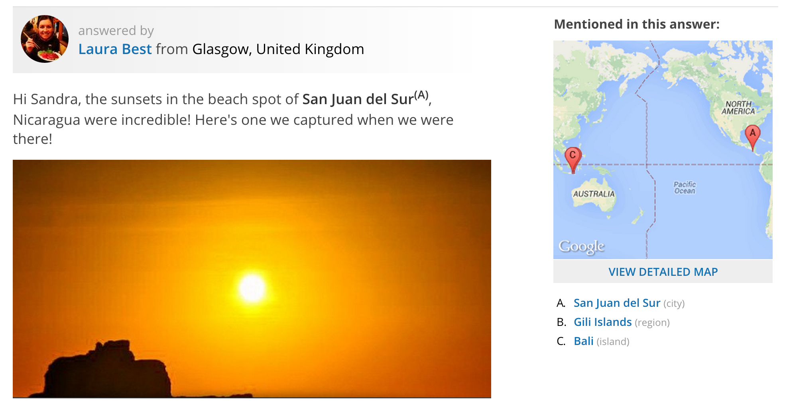
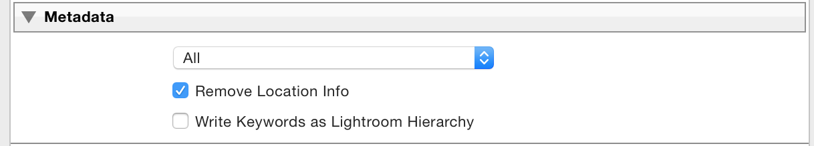
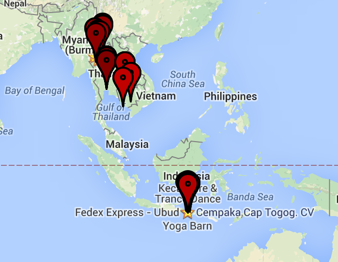
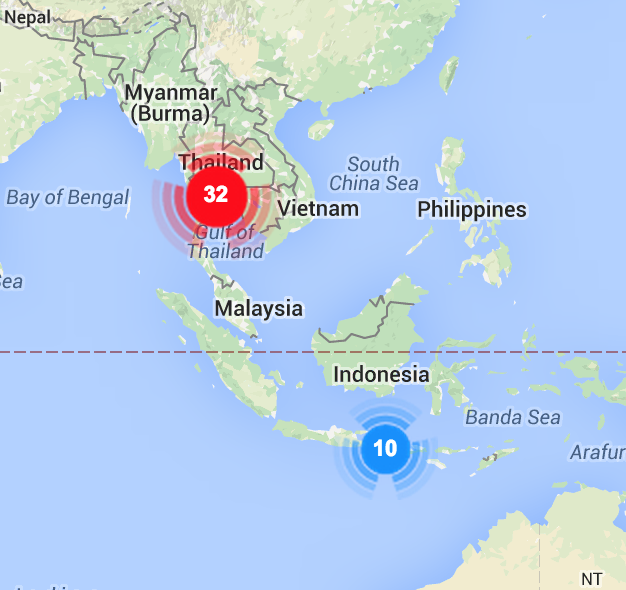
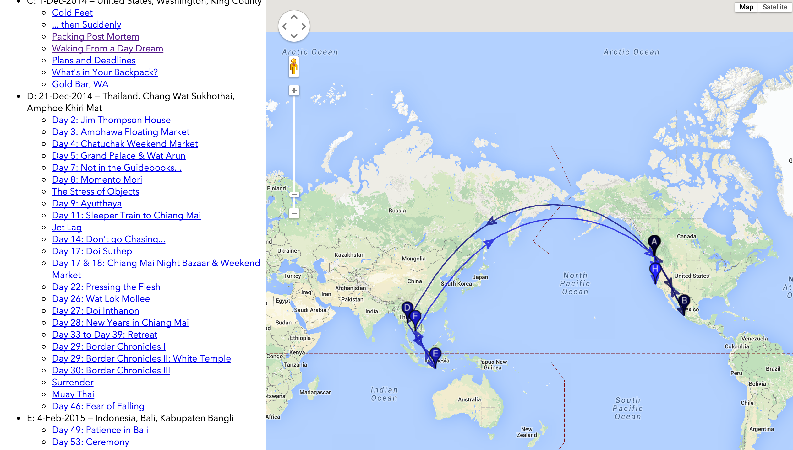

# The Problem

It's pretty obvious that conveying a sense of location and distance is key to a travel blog.  My travel [blog][my-blog] is simply the default standard list of posts, which conveys little of the place and route.  And that is frustrating: when I look at my blog as an outsider might, I realize how the sense of the journey is muddied and indistinct.

Casting about for small projects to take on, I decided to fix this.  Here are a bunch of ideas that came to mind to make it easier for readers to get a sense of each post post's context, what came before and what came afterwards:

* Using Categories and Tags consistently to identify all the places visited.  Then produce index pages for each of the places to quickly look up posts related to that place
* Writing up an itinerary page which puts all the posts in a time-and-location context
* Having each post cary some identifiers concerning which locations they reference

## Research

Before trying to solve the problem myself, I did a bit of research on existing solutions.  This is a safe place, so I can admit that I was secretly hoping none of the existing solutions would work, that I'd "have" to do it myself.  This is a sickness among engineers.

### Existing WordPress Plugins

#### [Simple Travel Map][simple-travel-map]

This plugin helps you create a simple travel map to display on your blog. The map is using the Google Geocharts API. Markers are placed on all locations found in your posts (inside a custom field of your choice). Clicking a marker links to the post associated with that specific location. Hovering over a marker opens a popup with the title and a thumbnail (if the post at that location has one).

#### [jKML Map][jkmlmap]

Javascript library for display KML files (Google Earth).  Seems like it doesn't do the collection piece of getting data from the blog; you need to generate the KML files elsewhere.

#### [Map My Posts][map-my-posts]

Here's what Map My Posts has to say for itself.

> With Map My Posts, you can easily create maps plotting the location of your posts, based upon your existing > tags or categories.
>  ▪  3 map types available: Google Maps, Google Static Maps (PNG image), and Geochart Visualizations.
> ▪  Embed maps on any page using the shortcodes [mmp-map], [mmp-staticmap], and [mmp-geochart]
> ▪  Associate with a country or any specific map location.
> ▪  Map My Posts uses existing category or tag names to help define country associations.
> ▪  Widgets available to display maps in the sidebar.
> ▪  Full control over size, colors, and click functions.
> ▪  Perfect for travel bloggers, touring musicians, or anyone else that wants to Map My Posts!

The reviews give kudos for the tag-> location mapping UI, but taking off a lot of points for flexibility.

#### [WP Geo][wp-geo]

Here's what WP Geo says:

> When editing a post or page, you will be able to set a physical location for that post and easily embed a
> Google map into your post. You can select the location by:
> 1. Clicking on the map of the world to position the point.
> 2. Searching for a location, town, city or address.
> 3. Entering the latitude and longitude.
> The WP Geo location selector is styled to fit seamlessly into the latest version of the WordPress admin.
> More information can be found at http://www.wpgeo.com/.

#### [Trippy](http://www.trippy.com)

The way the Tripply handles locations referenced in an article is great: a superscript followed identifying a marker on a map rendered in the margins.



### Summary

There are a bunch of solutions for adding more geographical information to a post.  The common solution in the WordPress community is to keep location data alongside the post using tags or categories and to generate these by hand, as part of the posts' creation.  This involves some kind of manual entry -- either by adding categories or via shortcodes.  I'd much rather work on an automated solution than a manual one.

This [article][exif-data-in-wordpress] offers another option: use photo GPS metadata to determine the location related to a post.  This is super attractive because it's automatic: I don't have to go back and add location data for all the posts I've already written.

Not knowing about the innards of WordPress, I didn't want to do extract the GPS in the WordPress upload path and store it in the WordPress database as the article shows.  And though I'm sure that there much be ways to batch-process previous posts using a similar technique, they aren't obvious to me in my ignorance.  Perhaps I'll save that for a future refinement.

What I can wasily do is write something on the client side.  Using my [previous experience][automatic-photo-essay] with the WordPress client API and my new increasing familiarity with Ruby I decided to opt for a client-side approach.  This easily handles the previous-post issue, but it's less elegant for adding location information to future posts.

Finally, essentially every solution uses Google Maps API -- so too shall I.

# Solution

The design I chose is straightforward:

1.  Enumerate all the posts, and then all the images in each post
2.  Extract the location data for each image
3.  Produce a database mapping of post to location(s)
4.  Render the database as a table of contents map allowing one to quickly see how many posts come from where and rapidly see a list from each location
5. (optionally) populate category metadata for each post with the location information thus mined, allowing whatever WordPress plugin to embed location information within each post

### Gotchas and Workarounds

The first implementation of the algorithm above was simple and relatively short, it's in the GitHub [repro][github-backtracker] as `backtracker.rb`.  Sadly, it sucked: only about 20% of the posts came back with any location information at all.  Why would this be?

After a lot of investigation, I figured out a couple of causes:

1. During the second portion of the trip, I refined my Lightroom workflow to tag and export pictures for each post.  Unfortunately, there's a small checkbox which lets you select whether to strip the GPS data from the files, presumably for privacy reasons.  This option was selected, so a bunch of the pictures didn't have coordinates
2. My blog editor, [MarsEdit][mars-edit] evidently does the same stripping when altering the resolution of an image upon upload



Later I'd discover another...

No problem, I thought: I have the original master photos, all safe in LightRoom.  Well, yes and no. Yes I have the originals, but no they're not easy to find: very often the file names where changed.  This was done with the best of intentions: 'IMG0456.jpg' is not as friendly as 'wat-pho-statue.jpg', but it make the job of tying blog images without GPS metadata to their originals with GPS metadata much harder.

In the end, I implemented a brute-force solution involving 4 different ways of finding the matching local images:

1. By name
2. By creation date and size
3. By *perceptual hash* with [phashion][phashion]
4. By mining the MarsEdit plist file containing details about the media upload transactions

While name, date and size are obvious matching characteristics, it's worth describing perceptual hashes and the MarsEdit lookup.

#### Perceptual Hash

[Perceptual hashing][perceptual-hashing] is a technique which summarizes an image into a hash which has the nice property of hashing similar-*looking* images into the same hash bucket.  This is in contrast with typical hashes which do not take the human perceptual system into account and simply hash 'similar' (in whatever way the algorithm considers similarity) sequences of bytes into the same bucket.

For example, if you change the resolution of a image, you'll likely completely change the stream of bytes and so a standard -- say MD5 -- hash will be completely different.  A perceptual hash is designed so that the changed image's hash will either the same value or something very close to it in terms of *Hamming distance* (i.e. the number of bits you'd need to flip to turn one number into the other). The same applies to other common image manipulations: monkeying with the colors, small rotations, some cropping.

[phashion][phashion] is a Ruby library I used to generate the perceptual hash for each image. It was incredibly easy to use, though for the volumes of images involved I used it to generate the hash only, then saved the hash in the database. In a later operation, a script would read the database and compare hashes using the Hamming distance.

#### MarsEdit

Many of my image uploads went through [MarsEdit][mars-edit]'s media uploader.  This is a great feature, but it defaults to resizing the image.  This isn't necessary since WordPress generates all the thumbnails now itself, but it had the effect of changing the file sizes.  Worse, I prefer to have a human-readable name instead of the camera default, so the names were different.

As a shot in the dark, I decided to see if MarsEdit help a history of these renames.  Luckily, it did.  Even better, the [support forum][mars-edit-forum] gave me all the information I needed very quickly.  It's such a so great to have such incredibly support from independent software folks.  It's a standard I'd like to live up to in all my work.

#### Final Algorithm

So the final algorithm to find local master copies for all the blog pictures is this:

1. `backtracker.rb` uses the [RubyPress][rubypress] WordPress client API to go through all the blog posts, get each image in each blog post and get the [first 128Kb][exif-data-in-first-128kb] of each image to search for the EXIF data.  It puts all the results in the JSON file `markers.js`<sup>1</sup>.
1. `find_local_blog_images.rb` goes through all the local masters and collects all the characteristics, including perceptual hash and puts them in a Sqlite database
1. `find_missing_gps_info.rb` loads `markers.js` and examines every image lacking GPS data and attempts to find a local copy from the database using all the various characteristics.

[mars-edit-forum]: http://www.red-sweater.com/forums/discussion/3524/best-way-to-map-all-uploaded-images-to-the-original-local-files#latest

This performed much better than `backtracker.rb` alone, as the output of `find_missing_gps_info.rb` shows:

```
Images already having GPS 56
Images found by create date: 106
Images found by MarsEdit map: 188
Images found by name and size: 1
Images found by perceptual hash 424
Images having GPS totals:
	already had it: 56
	found it locally: 199
	didn't find it: 212
Posts having GPS totals:
	already had it: 13
	found it locally: 50
	final count without: 22
```

Even with all this effort,  the number of posts without any location information was still much higher than I'd expected.  There were only a few posts with stock photos or none at all, so most of them should have had location information.

At my wits end, the only thing left do to was to brute force it: examine a bunch of posts I knew to have lots of photos with locations and figure out why they weren't showing up.  And that's where the last piece of the puzzle was revealed: large numbers -- maybe up to 50% -- of my *pristine* master photos didn't have GPS data.

Bummer.  I suppose my cameras aren't entirely reliable at getting a GPS fix.  And I know I'd had the habit at some times of turning on airplane mode on my phone to save battery and data connection usage.  This also turns off the GPS.

## Halfway There...

At this point, I found myself in a very common place for software tinkers: I'd spent a huge amount of time solving a problem I hadn't even known was a problem.  I started further behind than I knew.  The only benefit gained from the unanticipated effort was a bunch new things learned, things which might come in handy at some point down the road: more familiarity with Ruby, experience with perceptual hashing of images, sqlite programming, EXIF data (did you know you only have to GET the first 128kb of an image to be [sure to get its EXIF data][exif-data-in-first-128kb]?), etc..

Regardless, now I have this shiny new GPS data.  It's time to go back to the original point of this effort and actually *use* it.

### Map Table of Contents

The most compelling feature I wanted to add to my blog was an interactive table of contents showing the itinerary of "trip 1" and all the blog posts at the various locations along the way.

#### Which Location?

Since posts can have multiple images and hence multiple locations, I needed to decide how to handle these: do I collapse them all into one point or have each post generate multiple markers.

For simplicity's sake, I chose to have one location per post. In order to collapse multiple locations to one, I wrote some Javascript to find the mean location of a series of points.  This was also required to determine the initial viewport of the Google map, so that it was nicely centered around all the points on the map.  Here's the gist:

<script src="https://gist.github.com/iainbryson/2abf161d3afe64b676b6.js"></script>

#### First Approach

The simple approach is to use the google maps API to create a map, then place a marker at each location which contains a link to the blog post at that location.

This breaks down very quickly if you have more than 1 post at any one place: from a map expansive enough to contain both Thailand and Indonesia, any marker anywhere around say Bangkok will be in the same place.  You'll have to zoom in to see the posts.

Another problem is performance: rendering 70+ markers is not fast.  It's not impossibly slow, but it's enough of a problem to warrant seeking other solutions



The code for the page is [here][render-posts].

[render-posts]: https://github.com/iainbryson/backtracker/blob/master/render-posts.html

#### Fluster

The second approach is to cluster the posts for one location.  [Fluster][fluster] is a Javascript library that lets you do that.  It's always distressing when the last commit to a project in github was in 2011, but Fluster worked fine.  Its algorithm is straightforward: start with a point at random and cluster all the points which fit within the size of its icon.  Then show a marker with the number of sub-markers clustered there.



The Fluster solution worked fine.  But I also wanted to show the itinerary.  So I needed to cluster both by geographical location and by time.

The code for page is [here][render-post-clusters].

#### DBScan Clustering with Route Inference

Since I wanted to cluster posts which were not only closely in space but also in time, I needed to control the clustering function.  My first stop was [*k-means*][k-means], which I've loved since grad school for its intuitive methodology.  For this purpose, though, it has a big flaw: you have to guess the number of clusters. While I could have come up with an estimate (say by counting the number of unique cities visited), I liked the idea of the algorithm doing that work for me.

Enter DBSCAN ("Density-based spatial clustering of applications with noise"). I forked a Ruby implementation to [github][dbscan-github] and cleaned up a couple of implementation quirks with which I disagreed.  The code worked great and gave me some smart clusters when I provided it a "specio-temporal" objective function.  That's just a fancy way of saying I wanted clusters of events closeby in space and in time.  For example, two visits to Chiang Mai in different months should be two separate clusters.  Clustering this way lets me thread a route through he clusters simply by sorting them in time.

The objective function is straightforward:

```ruby
class Array
    def spacio_temporal_distance(n)
        $distanceMultiplier * Geocoder::Calculations::distance_between( self[0..1], n[0..1] ) + 10.0 * (self[2] - n[2] ).abs / (60*60*24)
    end
end
```

(The 3-tuple of each point is [latitude, longitude, seconds])

By modifying the `$distanceMultiplier` global and re-running the algorithm on each cluster to generate sub-clusters, I can create a hierarchy of clusters to be shown at appropriate zoom levels on the map.  So the large-scale maps show a reasonable number of markers -- and those markers don't overlap -- but one can always zoom in to a finer scale to look at all the maps.



#### Integrating the Map Into WordPress

The last bit of work was to put the single html page into the WordPress site as a Page.  This involved figuring out how to create a sub-theme which let me inject some functions to add the Google Maps API and other script references to the `<head>` of only the route map pages (after all, why load all that for every page?).

# Conclusion

So [there][sea-map] it is, the pretty routemap I wanted, produced by a lot of effort. First I decided to learn Ruby, then figure out the WordPress API enough to enumrate all the photos, then how to associate the uploaded photos with the local masters to get the GPS info, then determine a good clustering algorithm to find the routes, then learn enough of the Google maps API to render it nicely.

All the code is here at [a public GitHub repo][github-backtracker].

That's enough for V1 and way way too much for a single blog post. Yet there's no much more to do: what about the location information for places mentioned in the post? How can I get this to update in the future when I add more posts? I guess those are a future project...


-------
[sea-trip]: http://www.thecastawaylife.com/blog/trips/south-east-asia/

<sup>1</sup>: Not really JSON, actually Javascript because I was too lazy to write the AJAX query to load in a actual JSON file.

[looks-like-it]: http://www.hackerfactor.com/blog/?/archives/432-Looks-Like-It.html
[similar-image-detection]:https://www.amberbit.com/blog/2013/12/20/similar-images-detection-in-ruby-with-phash/
[hamming-distance]: https://en.wikipedia.org/wiki/Hamming_distance
[mars-edit-map]: http://www.red-sweater.com/forums/discussion/3524/best-way-to-map-all-uploaded-images-to-the-original-local-files#latest
[rubypress]: https://github.com/zachfeldman/rubypress
[perceptual-hashing]: https://en.wikipedia.org/wiki/Perceptual_hashing

[jkmlmap]: http://www.justin-klein.com/projects/jkmlmap/
[simple-travel-map]: https://wordpress.org/plugins/simple-travel-map/
[map-my-posts]: https://wordpress.org/plugins/map-my-posts/
[wp-geo]: https://wordpress.org/plugins/wp-geo/


[clustering-book]: http://flylib.com/books/en/2.367.1.102/1/

[my-blog]: http://thecastawaylife.com/blog
[github-backtracker]: https://github.com/iainbryson/backtracker
[phashion]: https://github.com/westonplatter/phashion
[automatic-photo-essay]: https://iainbryson.github.io/wordpress/photography/2015/02/01/photo-essay-workflow/
[mars-edit]: http://www.red-sweater.com/marsedit/
[render-hierarchical-routemap]: https://github.com/iainbryson/backtracker/blob/master/render-hierarchical-routemap.html
[generate-hierarchical-markers]: https://github.com/iainbryson/backtracker/blob/master/generate-hierarchical-markers.rb

[dbscan]: https://en.wikipedia.org/wiki/DBSCAN
[dbscan-github]: https://github.com/iainbryson/dbscan
[k-means]: https://en.wikipedia.org/wiki/K-means_clustering
[exif-data-in-wordpress]: http://www.kristarella.com/2008/12/geo-exif-data-in-wordpress/
[exifography]: http://www.kristarella.com/exifography/
[exif-data-in-first-128kb]: http://code.flickr.net/2012/06/01/parsing-exif-client-side-using-javascript-2/
[render-post-clusters]: https://github.com/iainbryson/backtracker/blob/master/render-post-clusters.html


